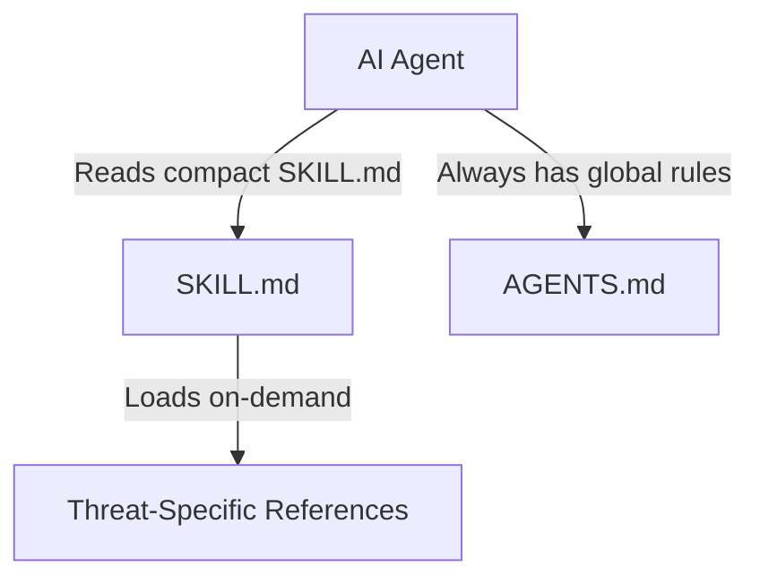

# Skill Quota Optimization Implementation Plan

> **For agentic workers:** REQUIRED SUB-SKILL: Use superpowers:subagent-driven-development to implement this plan task-by-task. Steps use checkbox (`- [ ]`) syntax for tracking.

**Goal:** Optimize skill configuration files in `.agents/skills` to minimize context token consumption.

**Architecture:** We will replace the verbose `SKILL.md` files with streamlined, compact versions that remove duplicate guidelines (already defined in global `AGENTS.md`) and implementation specifics (already defined in threat references), relying instead on targeted references loaded on-demand.

**Architecture Diagram:**


**Tech Stack:** Markdown / YAML frontmatter configurations.

## Global Constraints
- Do not modify reference files; only modify the main `SKILL.md` files in the skills folder.
- Ensure all YAML frontmatter headers remain intact.
- Keep all reference file links exact.

---

### Task 1: Optimize php-security SKILL.md

**Files:**
- Modify: [SKILL.md](file:///X:/pond-dev/git/agents-skills/.agents/skills/php-security/SKILL.md)

**Interfaces:**
- Produces: Streamlined `php-security/SKILL.md` under 2KB.

- [ ] **Step 1: Replace php-security SKILL.md content**
  Replace the entire content of `X:\pond-dev\git\agents-skills\.agents\skills\php-security\SKILL.md` with:
  ```markdown
  ---
  name: pond-php-security
  description: Secure-by-default guardrails for creating, modifying, debugging, and reviewing PHP applications across pure PHP, Laravel, Symfony, WordPress, CMS, API, CLI, and mixed-stack repositories. Use when explicitly invoked as $pond-php-security, when the user identifies the target as PHP, or when the task touches first-party PHP code, configuration, runtime behavior, dependencies, tests, or review/debug paths in a target with PHP indicators.
  ---

  # PHP Security

  Write PHP code to remain safe under malicious, malformed, duplicated, oversized, concurrent, expired, replayed, and unexpected input.

  ## Coordination
  - Apply this skill to all PHP changes.
  - Reuse one trace across active workflows. Do not repeat identical logic paths across sections.

  ## Context Gathering
  Before editing, scale context to risk:
  1. Inspect `composer.json`, `composer.lock`, and security configs.
  2. Trace path: Entry point -> Auth/Authz -> Validation -> Business logic -> Persistence -> Output/Logging.
  3. Identify trust boundaries and attacker-controlled values.

  ## Threat-Specific References
  Load only the references relevant to the task (do not preload unselected references):
  - **Web Input/Output**: [web-input-output.md](file:///X:/pond-dev/git/agents-skills/.agents/skills/php-security/references/web-input-output.md) (validation, XSS, CSRF, CORS, SQL/command injection, headers, logging, errors).
  - **Identity & Data**: [identity-data.md](file:///X:/pond-dev/git/agents-skills/.agents/skills/php-security/references/identity-data.md) (auth, roles, tenant isolation/IDOR, mass assignment, sessions, crypto, webhooks, state integrity).
  - **Files & Network**: [files-network-parsers.md](file:///X:/pond-dev/git/agents-skills/.agents/skills/php-security/references/files-network-parsers.md) (uploads, path traversal, SSRF, serialization/XML, parser/resource limits).
  - **Frameworks**: [frameworks.md](file:///X:/pond-dev/git/agents-skills/.agents/skills/php-security/references/frameworks.md) (Laravel, Symfony, WordPress, Pure PHP).
  - **Verification**: [verification.md](file:///X:/pond-dev/git/agents-skills/.agents/skills/php-security/references/verification.md) (security tests, dependency audit, completion report contract).

  ## Secure Workflow
  1. Map trust boundaries and identify attack vectors.
  2. Load relevant threat/framework references above.
  3. Reuse existing security controls; make the smallest secure change.
  4. Add negative/rejection tests for malicious/invalid inputs.
  5. Verify via repository tools and security checks (see [verification.md](file:///X:/pond-dev/git/agents-skills/.agents/skills/php-security/references/verification.md)).
  6. Report findings using the completion format in `verification.md`.
  ```

- [ ] **Step 2: Commit Task 1**
  ```bash
  git add .agents/skills/php-security/SKILL.md
  git commit -m "refactor(php-security): optimize SKILL.md to reduce token consumption"
  ```

---

### Task 2: Optimize agent-checkpoint SKILL.md

**Files:**
- Modify: [SKILL.md](file:///X:/pond-dev/git/agents-skills/.agents/skills/agent-checkpoint/SKILL.md)

**Interfaces:**
- Produces: Streamlined `agent-checkpoint/SKILL.md` under 1.5KB.

- [ ] **Step 1: Replace agent-checkpoint SKILL.md content**
  Replace the entire content of `X:\pond-dev\git\agents-skills\.agents\skills\agent-checkpoint\SKILL.md` with:
  ```markdown
  ---
  name: agent-checkpoint
  description: Use when the user explicitly requests durable Git checkpoints or cross-agent handoff, work resumes after quota exhaustion or a long pause, manual or external changes require reconciliation, or independent write tasks need durable state.
  ---

  # Agent Checkpoint

  Preserve recoverable task state in Git. Invocation does not grant edit/commit authority.

  ## Rules
  - **Authorization**: Only edit and commit locally when explicit checkpoint authorization is approved in a plan. Remain read-only otherwise.
  - **Safety**: Never push, merge, rebase, reset, tag, delete branches, or bypass hooks.
  - **Handoff**: Maintain one handoff per task (under 500 words) using `assets/handoff-template.md` copied to `.ai/handoffs/<task-id>.md`. Update with each checkpoint.

  ## Route
  Read only the reference required for your operation (do not preload unselected references):
  - **Start/Checkpoint/Complete**: [checkpoint.md](file:///X:/pond-dev/git/agents-skills/.agents/skills/agent-checkpoint/references/checkpoint.md)
  - **Resume**: [resume.md](file:///X:/pond-dev/git/agents-skills/.agents/skills/agent-checkpoint/references/resume.md)
  - **Parallel Work**: [parallel.md](file:///X:/pond-dev/git/agents-skills/.agents/skills/agent-checkpoint/references/parallel.md) (plus the operation reference above)

  ## Report
  Upon checkpointing or completion, report:
  - Task, branch, worktree, latest checkpoint SHA & state.
  - Staged, unstaged, and intentionally uncommitted paths.
  - Exact verification outcomes (passed/skipped checks).
  - Next actions and required approvals.
  ```

- [ ] **Step 2: Commit Task 2**
  ```bash
  git add .agents/skills/agent-checkpoint/SKILL.md
  git commit -m "refactor(agent-checkpoint): optimize SKILL.md to reduce token consumption"
  ```

---

### Task 3: Optimize concise-output SKILL.md

**Files:**
- Modify: [SKILL.md](file:///X:/pond-dev/git/agents-skills/.agents/skills/concise-output/SKILL.md)

**Interfaces:**
- Produces: Streamlined `concise-output/SKILL.md` under 1KB.

- [ ] **Step 1: Replace concise-output SKILL.md content**
  Replace the entire content of `X:\pond-dev\git\agents-skills\.agents\skills\concise-output\SKILL.md` with:
  ```markdown
  ---
  name: pond-concise-output
  description: Use when the user explicitly asks for concise, terse, short, brief, compact, no long explanation, just the answer, summary only, or minimal prose. Compresses user-facing responses for ordinary work. Do not use to skip required investigation, validation, citations, safety caveats, debug evidence, security findings, review verdicts, or fields required by active skills.
  ---

  # Concise Output

  Reduce prose, not rigor. Keep all workflow evidence, reproduction details, review findings, security boundaries, and required reports fully intact.

  ## Rules
  - **Response Shape**: Use the shortest format that answers the query (e.g., single sentence for facts/confirmations, single paragraph for small code changes, up to 5 bullets for summaries). No feature tours, repeated rationale, or generic caveats.
  - **Keep Essential Details**: Do not compress away exact paths/commands, failed checks, safety/data-loss caveats, material assumptions, dates, or versions.
  - **User Preference**: If the user requests detail, provide it while keeping sections tight.
  ```

- [ ] **Step 2: Commit Task 3**
  ```bash
  git add .agents/skills/concise-output/SKILL.md
  git commit -m "refactor(concise-output): optimize SKILL.md to reduce token consumption"
  ```
